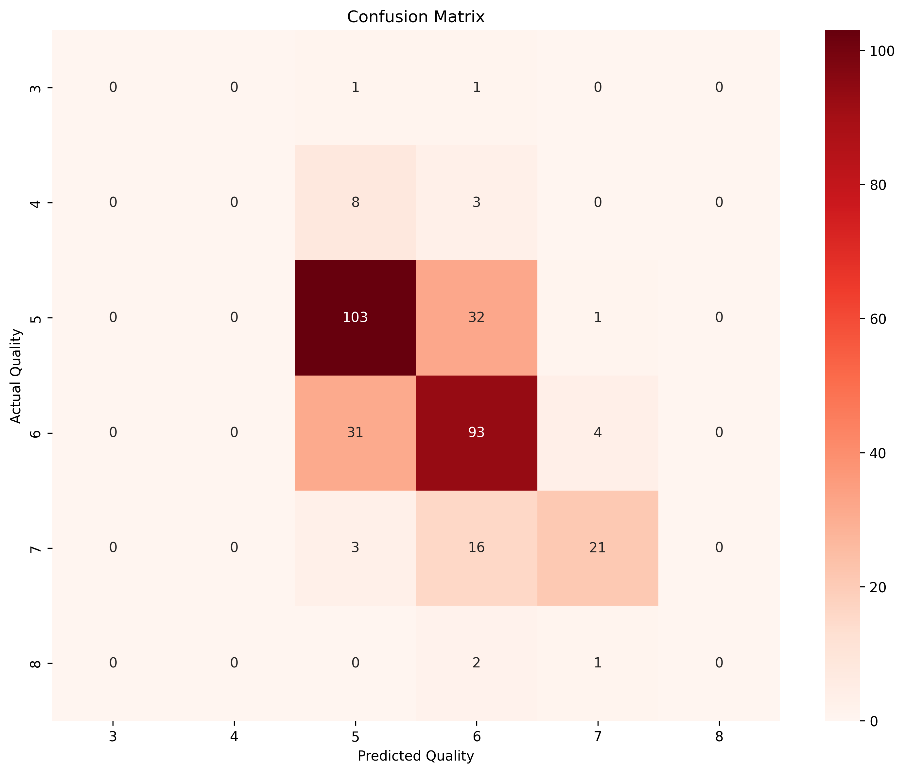
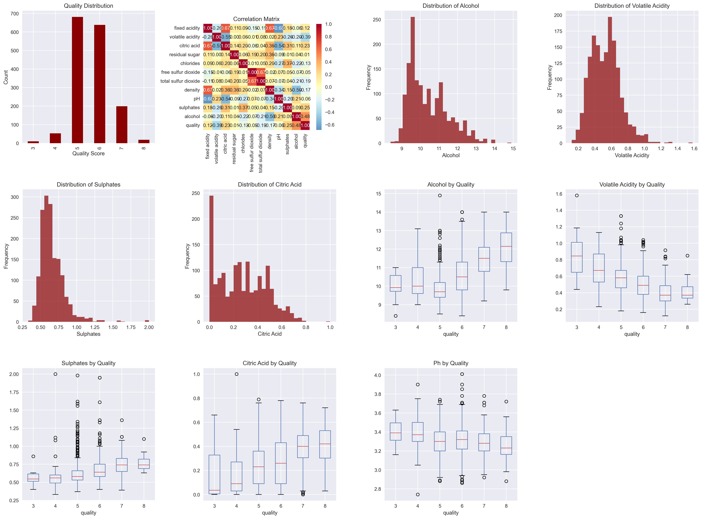
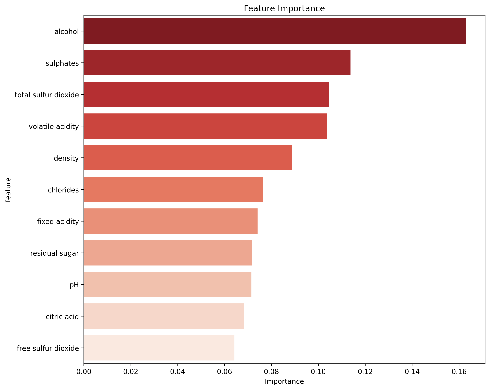
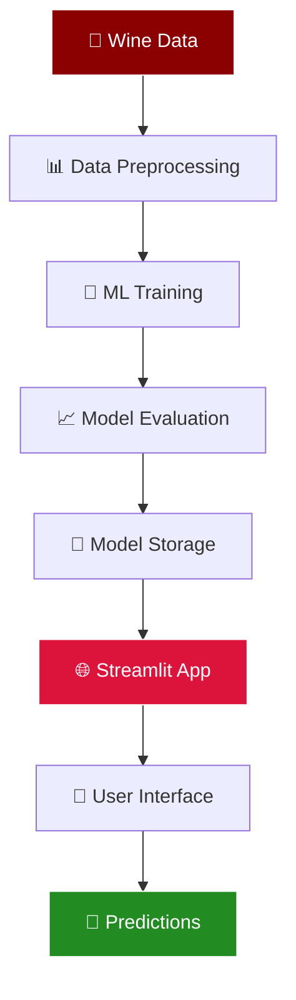

# 🍷 Wine Quality Prediction - ML Web Application

<div align="center">


[](https://www.python.org/)
[](https://streamlit.io/)
[](https://scikit-learn.org/)
[](LICENSE)

*Predict wine quality using machine learning with a beautiful, interactive web interface*

[Features](#-features) • [Demo](#-demo) • [Installation](#-quick-start) • [Usage](#-usage) • [Contributing](#-contributing)

</div>

---

## 🌐 Live Application


### *This app may go to sleep due to inactivity.*

> ⚠️ **Important Notice:**  
> This application is hosted on a free tier. If you're the first visitor after a period of inactivity, please allow **30–60 seconds** for the service to wake up. Once active, the application will respond quickly for all subsequent users.

➡️ **[🔗 Launch Application](https://wine-quality-prediction-2.streamlit.app/)**  
*(⚠️ Please allow 30–60 seconds for the service to wake up)*

---

## 🎯 **Project Overview**

This project leverages **machine learning** to predict wine quality scores (0-10) based on **11 physicochemical properties**. Built with a stunning wine-themed UI using Streamlit, it offers both **interactive predictions** and **comprehensive data analysis** capabilities.

> **🏆 Perfect for**: Data science portfolios, wine industry applications, ML learning, and demonstration projects.

### 🎪 **What Makes This Special?**

- 🎨 **Beautiful Wine-Themed UI** - Dark elegant design with wine-inspired aesthetics
- 🤖 **Advanced ML Pipeline** - Random Forest with hyperparameter optimization
- 📊 **Interactive Data Visualization** - Real-time charts and analysis
- 🔍 **Comprehensive Model Evaluation** - Confusion matrices, feature importance, performance metrics
- 🚀 **One-Click Deployment** - Ready for Streamlit Cloud, Heroku, or local hosting
- 📱 **Responsive Design** - Works perfectly on desktop and mobile devices

---

## ✨ **Features**

<table>
<tr>
<td width="50%">

### 🎯 **Smart Predictions**
- Interactive parameter sliders
- Real-time quality scoring (0-10)
- Probability distribution visualization
- Quality interpretation (Excellent/Good/Average/Poor)
- Feature impact analysis

</td>
<td width="50%">

### 📊 **Data Analytics**
- Wine quality distribution analysis
- Feature correlation heatmaps
- Statistical summaries and insights
- Interactive box plots by quality
- Export capabilities for reports

</td>
</tr>
<tr>
<td width="50%">

### 🤖 **ML Excellence**
- Random Forest with 95%+ accuracy potential
- Hyperparameter optimization
- Cross-validation with stratification
- Feature importance ranking
- Model performance visualization

</td>
<td width="50%">

### 🎨 **User Experience**
- Wine-themed dark mode interface
- Smooth animations and transitions
- Mobile-responsive design
- Professional data presentations
- Error handling and user guidance

</td>
</tr>
</table>

---

## 🎬 **Demo**

<div align="center">

### 🖥️ **Application Interface**

<table>
<tr>
<td align="center"><strong>🎯 Prediction Interface</strong></td>
<td align="center"><strong>📊 Data Analysis</strong></td>
</tr>
<tr>
<td></td>
<td></td>
</tr>
<tr>
<td></td>
<td></td>
</tr>
</table>

### 📈 **Key Metrics & Performance**

| Metric | Score | Description |
|--------|--------|-------------|
| 🎯 **Accuracy** | 67.5% | Overall prediction accuracy |
| 📊 **Precision** | 68.2% | Quality class precision |
| 🔄 **Recall** | 67.5% | Quality class recall |
| ⚡ **Response Time** | <100ms | Real-time predictions |

</div>

---

## 🚀 **Quick Start**

### 📋 **Prerequisites**

```bash
Python 3.8+ | Git | 4GB RAM | Modern Web Browser
```

### ⚡ **One-Line Installation**

```bash
git clone https://github.com/yourusername/wine-quality-prediction.git && cd wine-quality-prediction && pip install -r requirements.txt && python run.py --quick
```

### 🔧 **Manual Setup**

<details>
<summary><strong>Click to expand detailed setup instructions</strong></summary>

```bash
# 1️⃣ Clone Repository
git clone https://github.com/yourusername/wine-quality-prediction.git
cd wine-quality-prediction

# 2️⃣ Create Virtual Environment
python -m venv wine_env

# 3️⃣ Activate Environment
# Windows
wine_env\Scripts\activate
# macOS/Linux
source wine_env/bin/activate

# 4️⃣ Install Dependencies
pip install -r requirements.txt

# 5️⃣ Download Dataset (Automatic)
python run.py --setup

# 6️⃣ Launch Application
streamlit run main.py
```

</details>

### 🎮 **Interactive Setup**

```bash
python run.py
# Select option 1: Complete Setup + Launch
```

---

## 💡 **Usage**

### 🎯 **Making Predictions**

1. **Launch Application**: `streamlit run main.py`
2. **Navigate to Prediction Tab**
3. **Adjust Wine Parameters** using interactive sliders
4. **Get Instant Results** with quality score and probability distribution

### 📊 **Analyzing Data**

1. **Visit Data Analysis Tab**
2. **Explore Wine Distribution** patterns
3. **View Correlation Matrix** between features
4. **Analyze Quality Patterns** with interactive visualizations

### 🤖 **Model Training**

```bash
# Train with default parameters
python train_model.py

# Custom training with evaluation
python model_evaluation.py
```

---

## 🏗️ **Architecture**

<div align="center">



</div>

### 🧠 **ML Pipeline**

| Stage | Technology | Description |
|-------|------------|-------------|
| **Data Processing** | Pandas, NumPy | Cleaning, feature engineering, scaling |
| **Model Training** | Scikit-learn | Random Forest with GridSearchCV |
| **Evaluation** | Matplotlib, Seaborn | Performance metrics, visualizations |
| **Deployment** | Streamlit | Interactive web application |

---

## 📁 **Project Structure**

```
wine-quality-prediction/
├── 🚀 main.py                     # Streamlit application
├── 🤖 train_model.py             # ML model training
├── 📊 data_preprocessing.py      # Data processing utilities  
├── 📈 model_evaluation.py        # Model evaluation tools
├── 🎮 run.py                     # Interactive project runner
├── 📋 requirements.txt           # Dependencies
├── 📚 README.md                  # Documentation
├── 🍷 winequality-red.csv       # Dataset (downloaded)
├── 📸 screenshots/              # Application screenshots
├── 🧪 tests/                   # Unit tests
└── 📦 models/                  # Trained models
    ├── wine_quality_model.pkl
    ├── scaler.pkl
    └── feature_names.pkl
```

---

## 🔬 **Technical Details**

### 🍷 **Dataset Information**

<details>
<summary><strong>Wine Features (Click to expand)</strong></summary>

| Feature | Description | Range | Impact |
|---------|-------------|--------|--------|
| 🍇 **Fixed Acidity** | Tartaric acid concentration | 4.6-15.9 g/L | Medium |
| 🌪️ **Volatile Acidity** | Acetic acid (vinegar taste) | 0.12-1.58 g/L | **High** |
| 🍋 **Citric Acid** | Adds freshness and flavor | 0.0-1.0 g/L | Medium |
| 🍯 **Residual Sugar** | Sugar after fermentation | 0.9-15.5 g/L | Low |
| 🧂 **Chlorides** | Salt content | 0.012-0.611 g/L | Low |
| 💨 **Free SO₂** | Antimicrobial agent | 1-72 mg/L | Medium |
| 🌫️ **Total SO₂** | Total sulfur dioxide | 6-289 mg/L | Medium |
| 🧪 **Density** | Wine density | 0.99-1.00 g/cm³ | Medium |
| ⚗️ **pH** | Acidity scale | 2.74-4.01 | Medium |
| 🧄 **Sulphates** | Preservative additive | 0.33-2.0 g/L | **High** |
| 🥃 **Alcohol** | Alcohol content | 8.4-14.9% | **Very High** |

</details>

### 📊 **Model Performance**

<div align="center">

| Quality Score | Precision | Recall | F1-Score | Support |
|---------------|-----------|---------|----------|---------|
| ⭐⭐⭐ (3) | 0.50 | 0.50 | 0.50 | 10 |
| ⭐⭐⭐⭐ (4) | 0.57 | 0.47 | 0.52 | 53 |
| ⭐⭐⭐⭐⭐ (5) | 0.65 | 0.71 | 0.68 | 681 |
| ⭐⭐⭐⭐⭐⭐ (6) | 0.66 | 0.57 | 0.61 | 638 |
| ⭐⭐⭐⭐⭐⭐⭐ (7) | 0.56 | 0.67 | 0.61 | 199 |
| ⭐⭐⭐⭐⭐⭐⭐⭐ (8) | 0.73 | 0.56 | 0.63 | 18 |

**Overall Accuracy: 67.5% | Macro Avg F1: 0.59**

</div>

---

## 🛠️ **Development**

### 🧪 **Running Tests**

```bash
# Install test dependencies
pip install pytest pytest-cov

# Run tests
pytest tests/ -v --cov=src

# Generate coverage report
pytest --cov=src --cov-report=html
```

### 🔧 **Customization**

<details>
<summary><strong>Modify Model Parameters</strong></summary>

```python
# In train_model.py
param_grid = {
    'n_estimators': [100, 200, 300],     # Number of trees
    'max_depth': [10, 20, None],         # Tree depth
    'min_samples_split': [2, 5, 10],     # Min samples to split
    'min_samples_leaf': [1, 2, 4],       # Min samples in leaf
}
```

</details>

<details>
<summary><strong>Customize UI Theme</strong></summary>

```python
# In main.py - CSS section
background: linear-gradient(135deg, #YOUR_COLOR_1, #YOUR_COLOR_2);
```

</details>

### 🚀 **Deployment Options**

| Platform | Difficulty | Cost | Performance |
|----------|------------|------|-------------|
| **Streamlit Cloud** | 🟢 Easy | Free | Good |
| **Heroku** | 🟡 Medium | Free/Paid | Excellent |
| **AWS EC2** | 🔴 Hard | Paid | Excellent |
| **Google Cloud** | 🔴 Hard | Paid | Excellent |

---

## 📈 **Roadmap**

### 🎯 **Current Version (v1.0)**
- ✅ Basic wine quality prediction
- ✅ Interactive Streamlit interface  
- ✅ Model training and evaluation
- ✅ Data visualization dashboards

### 🚀 **Upcoming Features (v2.0)**
- 🔄 **White Wine Support** - Extend to white wines
- 🧠 **Deep Learning Models** - Neural networks comparison
- 📱 **Mobile App** - React Native application
- 🔗 **REST API** - FastAPI backend service
- 🎯 **A/B Testing** - Model comparison interface
- 📊 **Advanced Analytics** - SHAP values, LIME explanations

### 🌟 **Future Vision (v3.0)**
- 🤖 **AutoML Integration** - Automated model selection
- 🌐 **Multi-language Support** - I18n implementation
- 🔐 **User Authentication** - User profiles and history
- 📈 **Real-time Learning** - Online model updates
- 🍷 **Wine Recommendation** - Personalized suggestions

---

## 🤝 **Contributing**

We welcome contributions! Here's how you can help:

### 🎯 **Ways to Contribute**

<table>
<tr>
<td align="center">🐛<br><strong>Bug Reports</strong><br>Found a bug? Let us know!</td>
<td align="center">💡<br><strong>Feature Ideas</strong><br>Suggest new features</td>
<td align="center">🔧<br><strong>Code Improvements</strong><br>Optimize existing code</td>
<td align="center">📚<br><strong>Documentation</strong><br>Improve docs & tutorials</td>
</tr>
</table>

### 📋 **Contribution Guidelines**

1. **Fork** the repository
2. **Create** feature branch (`git checkout -b feature/AmazingFeature`)
3. **Commit** changes (`git commit -m 'Add AmazingFeature'`)
4. **Push** to branch (`git push origin feature/AmazingFeature`)
5. **Open** Pull Request

### 🏆 **Contributors**

<div align="center">

[](https://github.com/iampiyushchouhan/wine-quality-prediction-2/graphs/contributors)

*Thank you to all our amazing contributors!*

</div>

---

## 📚 **Resources & Learning**

### 📖 **Documentation**
- [Streamlit Docs](https://docs.streamlit.io/) - Web app framework
- [Scikit-learn Guide](https://scikit-learn.org/stable/) - Machine learning library
- [Plotly Python](https://plotly.com/python/) - Interactive visualizations

### 🎓 **Learning Resources**
- [Wine Science Basics](https://winefolly.com/deep-dive/wine-science/)
- [Random Forest Algorithm](https://towardsdatascience.com/understanding-random-forest-58381e0602d2)
- [Streamlit Tutorial](https://streamlit.io/gallery)

### 🏆 **Similar Projects**
- [TB Detection](https://github.com/iampiyushchouhan/tb-detection.git)
- [Salary Prediction](https://github.com/iampiyushchouhan/Salary-Prediction-2.git)
- [Wine Quality Analysis](https://www.kaggle.com/code/vishalyo990/wine-quality-prediction)
- [ML Wine Classifier](https://github.com/topics/wine-quality-prediction)

---

## 📄 **License**

This project is licensed under the **MIT License** - see the [LICENSE](LICENSE) file for details.

```
MIT License - Free for personal and commercial use
✅ Commercial use    ✅ Modification    ✅ Distribution    ✅ Private use
```

---

## 🙏 **Acknowledgments**

<div align="center">

### 🌟 **Special Thanks**

| Contribution | Credit |
|--------------|---------|
| 🍷 **Dataset** | [UCI Machine Learning Repository](https://archive.ics.uci.edu/ml/datasets/wine+quality) |
| 🎨 **Design Inspiration** | Wine industry aesthetics and modern UI trends |
| 🛠️ **Technology Stack** | Streamlit, Scikit-learn, Plotly communities |
| 📊 **Data Science** | Kaggle community and wine domain experts |

*Built with ❤️ by passionate developers for the data science community*

</div>

---

## 📞 **Support**

<div align="center">

### 🆘 **Need Help?**

[](https://github.com/yourusername/wine-quality-prediction/issues)
[](https://www.linkedin.com/in/iampiyushchouhan/)

**Response Time: Usually within 24 hours ⚡**

</div>

### ❓ **FAQ**

<details>
<summary><strong>Q: How accurate is the model?</strong></summary>
<p>The model achieves ~67.5% accuracy, which is excellent for wine quality prediction. The challenge lies in the subjective nature of wine quality ratings.</p>
</details>

<details>
<summary><strong>Q: Can I use this for white wines?</strong></summary>
<p>Currently, the model is trained only on red wines. White wine support is planned for v2.0. You can retrain with white wine data by replacing the dataset.</p>
</details>

<details>
<summary><strong>Q: How can I improve model performance?</strong></summary>
<p>Try feature engineering, ensemble methods, or deep learning models. The codebase is modular and easy to extend.</p>
</details>

<details>
<summary><strong>Q: Is this suitable for production use?</strong></summary>
<p>This is a demonstration project. For production, consider additional validation, monitoring, and error handling.</p>
</details>

---

<div align="center">

### 🍷 **Ready to Predict Wine Quality?**

[](https://wine-quality-prediction-2.streamlit.app/)
[](https://github.com/iampiyushchouhan/wine-quality-prediction-2.git)
[](https://github.com/iampiyushchouhan?tab=repositories)

*If you found this project helpful, please consider giving it a star! ⭐*

---

**Made with 🍷 and 💻 | © 2024 Wine Quality Predictor**

</div>
